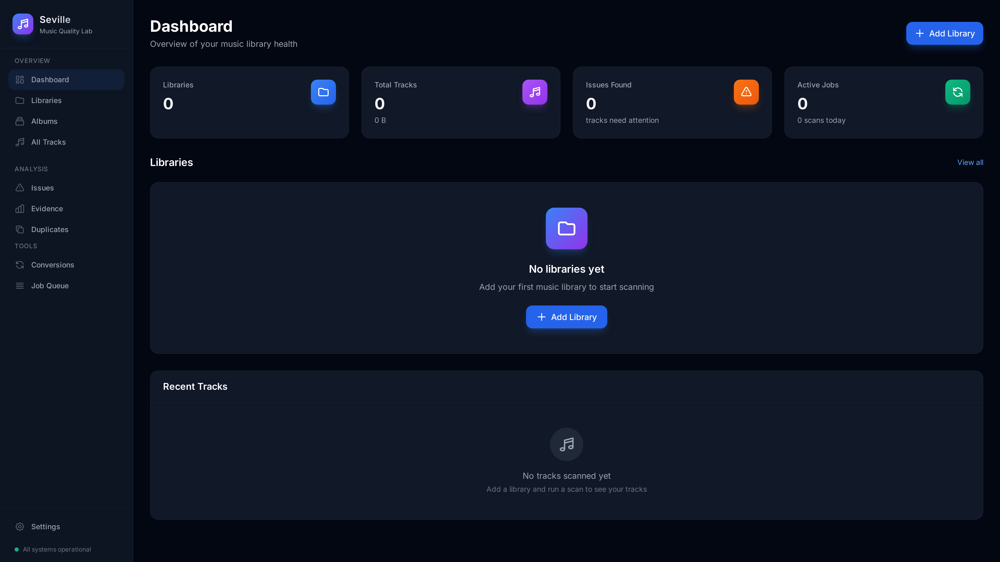
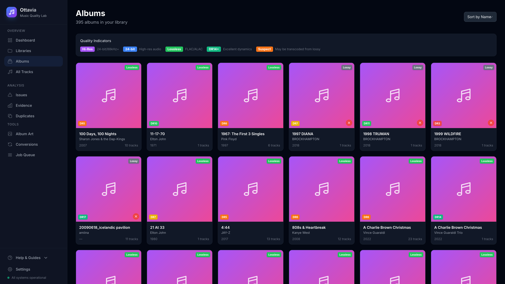
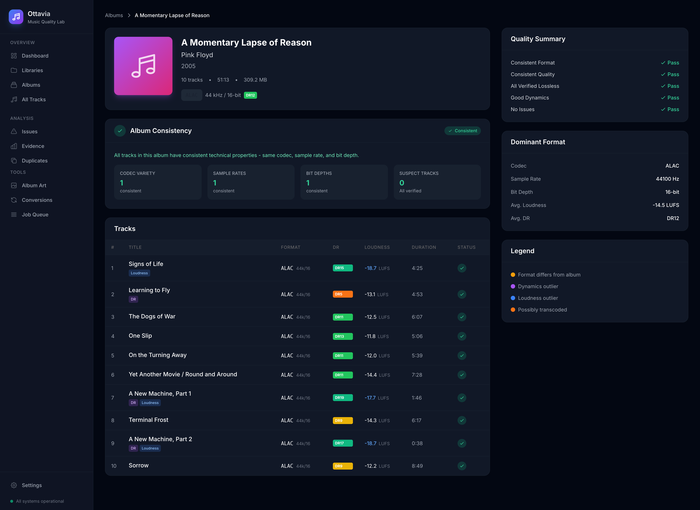
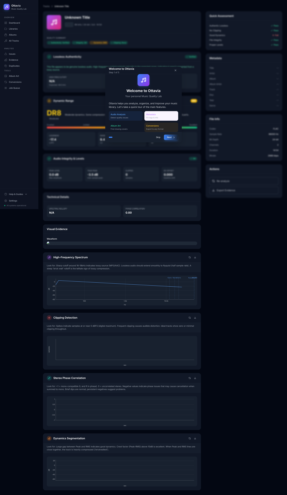
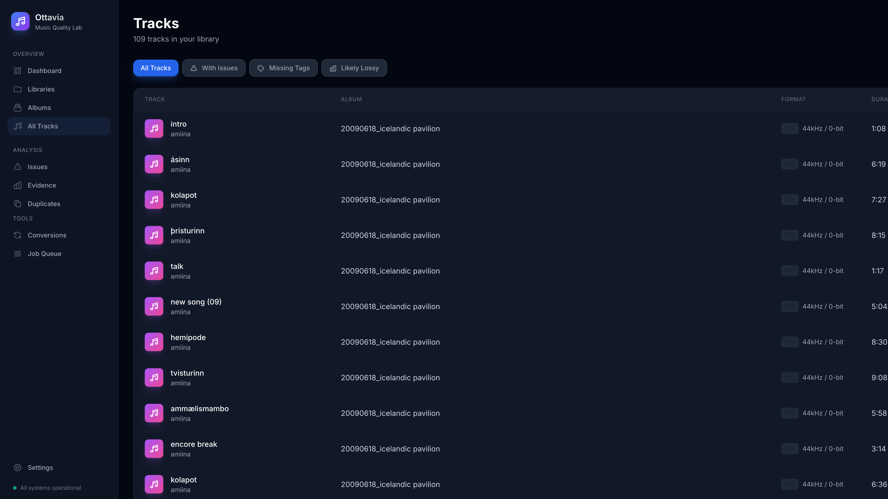
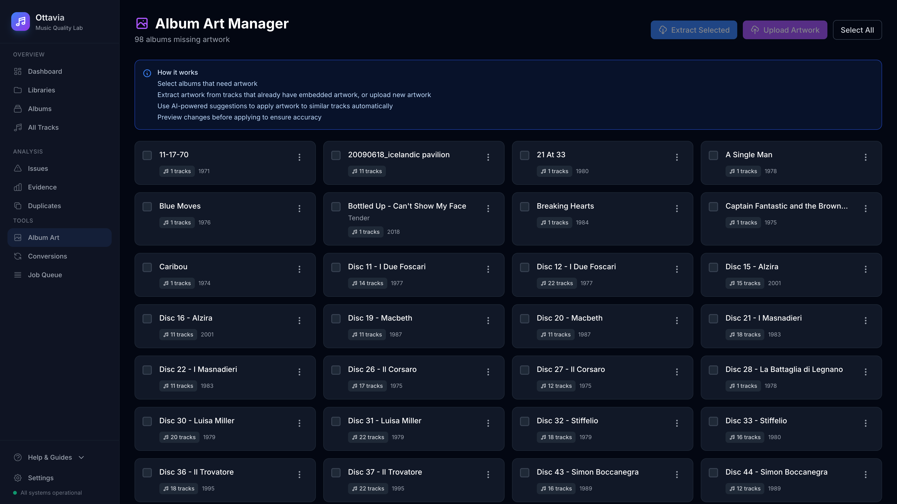
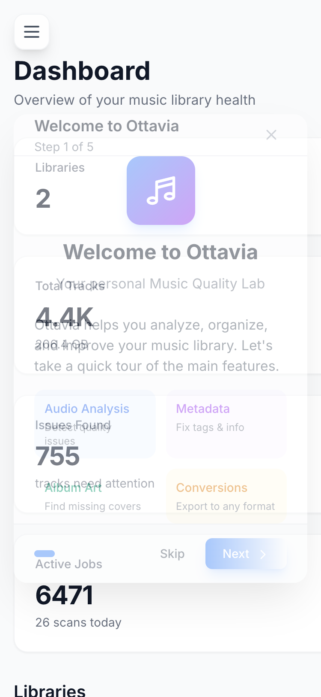
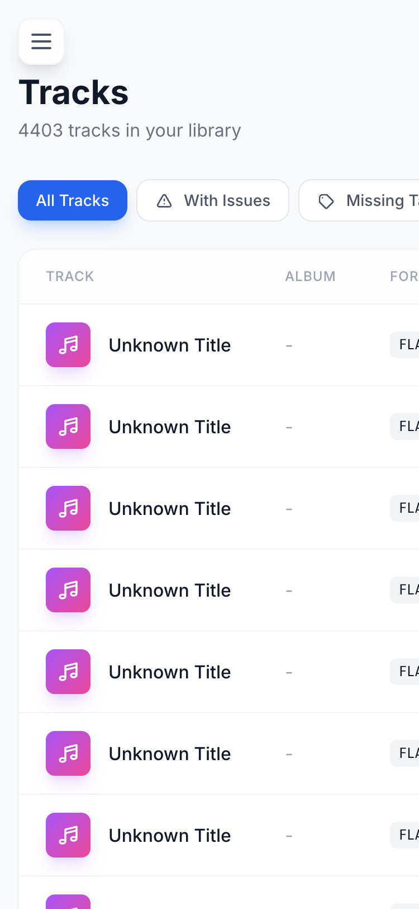

<p align="center">
  
</p>

<h1 align="center">Ottavia</h1>
<h3 align="center">Music Quality Lab</h3>

<p align="center">
  A self-hosted music quality analysis tool for audiophiles. Verify lossless authenticity,<br>
  detect loudness war compression, audit metadata, and manage format conversions.
</p>

<p align="center">
  <a href="#features">Features</a> •
  <a href="#screenshots">Screenshots</a> •
  <a href="#installation">Installation</a> •
  <a href="#usage">Usage</a> •
  <a href="#api">API</a> •
  <a href="#roadmap">Roadmap</a>
</p>

<p align="center">
  
  
  
  
</p>

<p align="center">
  
  
  
</p>

<p align="center">
  
  
  
</p>

---

## Why Ottavia?

Are your "lossless" files actually lossless? Many FLAC and ALAC files in the wild are transcoded from lossy MP3 or AAC sources. Ottavia helps you:

- **Verify authenticity** - Detect files that may have been upsampled from lossy sources
- **Analyze dynamics** - Identify "loudness war" casualties with crushed dynamic range
- **Audit metadata** - Find missing tags, inconsistent album info, and missing artwork
- **Maintain consistency** - Spot format outliers within albums (different codecs, sample rates)
- **Convert intelligently** - Transcode to different formats while tracking provenance

---

## Features

### Lossless Authenticity Verification
- Detects spectral cutoffs and rolloff characteristics typical of lossy transcodes
- Provides confidence scores (0-100%) with plain-English explanations
- Visual "Verified Lossless" or "Possibly Transcoded" badges
- Export analysis evidence as JSON for further review

### Dynamic Range (DR) Analysis
- Industry-standard DR measurement for loudness war detection
- Visual scale from "Crushed" (DR1-4) to "Excellent" (DR14+)
- Color-coded badges at a glance
- Compare DR scores across album tracks to spot mastering inconsistencies

### Album Consistency Analysis
- Detect format outliers (different codecs, sample rates, bit depths)
- Identify DR and loudness outliers within an album
- Highlight possible transcoded tracks
- Quality summary sidebar with Pass/Check indicators

### Pro-Level Audio Metrics
- Peak level and true peak detection (dBFS)
- Clipping detection with exact sample counts
- Integrated loudness (LUFS) and loudness range (LRA)
- DC offset and phase correlation analysis
- Waveform visualization with peak markers
- File integrity verification

### Metadata Management
- Comprehensive tag auditing
- Missing/inconsistent tag detection
- Safe write pipeline with atomic operations
- Bulk operations (normalize album artist, fix track numbering)
- Full action log for audit trail

### Album Art Manager
- Detect albums missing artwork at a glance
- Extract embedded artwork from audio files
- Upload custom artwork with drag-and-drop
- Bulk apply artwork to multiple tracks
- AI-powered suggestions for similar tracks
- Smart matching by album name and artist

### Dynamic Audio Analysis (Audio Scan-style)
- Interactive, zoomable charts rendered in the browser
- Spectrum analysis with frequency bandwidth detection
- Loudness timeline (momentary/short-term LUFS)
- Clipping detection with visual timeline
- Phase correlation analysis for stereo tracks
- Dynamics segmentation with per-section DR scores
- Raw data export (MessagePack + Zstd compressed)

### Format Conversion
- Built-in profiles (iPod-compatible, CD quality, high-res)
- Queue-based processing with progress tracking
- Provenance tracking (link output to source + profile)
- Separate output directory support (never modifies source files)

### Modern UI
- Clean Apple-inspired glassmorphism design
- Dark/Light theme with system preference detection
- Fully responsive (desktop, tablet, mobile)
- Real-time updates with HTMX

### Self-Hosted & NAS-Friendly
- Single binary deployment
- SQLite database (no external dependencies)
- Low resource footprint
- Tested on Synology, QNAP, Unraid, TrueNAS
- Works on AlmaLinux, Ubuntu, Debian, macOS
- Read-only source support (never modifies your original files)
- Configurable output directory for conversions

---

## Screenshots

<p align="center">
  
  <br>
  <em>Dashboard Overview - Track your library health at a glance</em>
</p>

<p align="center">
  
  <br>
  <em>Albums Browser - Browse by album with quality badges and DR scores</em>
</p>

<p align="center">
  
  <br>
  <em>Album Consistency View - Spot format outliers and transcodes within albums</em>
</p>

<p align="center">
  
  <br>
  <em>Pro-Level Track Analysis - Full quality assessment with DR scoring</em>
</p>

<p align="center">
  
  <br>
  <em>Tracks Browser - Filter by issues, search, and bulk select</em>
</p>

<p align="center">
  
  <br>
  <em>Album Art Manager - Find and fix missing artwork with AI-powered suggestions</em>
</p>

<p align="center">
  
  <br>
  <em>Conversion Queue - Monitor format conversions with progress tracking</em>
</p>

<p align="center">
  
  
  <br>
  <em>Mobile Responsive - Full functionality on any device</em>
</p>

---

## Installation

### Prerequisites

- Go 1.22+
- Node.js 18+ (for Tailwind CSS build)
- FFmpeg and FFprobe
- SQLite 3.35+

### Quick Start

```bash
# Clone the repository
git clone https://github.com/ParkWardRR/Ottavia-NAS-Music-Quality-Lab.git
cd Ottavia-NAS-Music-Quality-Lab

# Install dependencies and build
make deps
make all

# Run the server
./server -config config.yaml
```

Open http://localhost:8080 in your browser.

### Docker

```bash
docker run -d \
  --name ottavia \
  -p 8080:8080 \
  -v /path/to/music:/music:ro \
  -v ottavia-data:/data \
  ghcr.io/parkwardrr/ottavia:latest
```

### From Source

```bash
# Install templ
go install github.com/a-h/templ/cmd/templ@latest

# Install npm dependencies
npm install

# Build everything
make all

# Or step by step
make templ   # Generate Go templates
make css     # Build Tailwind CSS
make build   # Compile binary
```

### Production Deployment (systemd)

```bash
# Copy binary
sudo cp server /usr/local/bin/ottavia

# Create systemd service
sudo tee /etc/systemd/system/ottavia.service << EOF
[Unit]
Description=Ottavia Music Quality Lab
After=network.target

[Service]
Type=simple
User=ottavia
ExecStart=/usr/local/bin/ottavia -config /etc/ottavia/config.yaml
Restart=always
RestartSec=5

[Install]
WantedBy=multi-user.target
EOF

# Enable and start
sudo systemctl enable --now ottavia
```

---

## Configuration

Create a `config.yaml`:

```yaml
server:
  host: "0.0.0.0"
  port: 8080

database:
  driver: "sqlite3"
  dsn: "/data/ottavia.db"

scanner:
  default_interval: "15m"
  worker_count: 4
  batch_size: 100

storage:
  artifacts_path: "/data/artifacts"
  temp_path: "/tmp/ottavia"

ffmpeg:
  ffprobe_path: "ffprobe"
  ffmpeg_path: "ffmpeg"
```

### Environment Variables

| Variable | Description | Default |
|----------|-------------|---------|
| `OTTAVIA_CONFIG` | Config file path | `./config.yaml` |
| `OTTAVIA_PORT` | Server port | `8080` |
| `OTTAVIA_DB_DSN` | Database path | `./ottavia.db` |
| `OTTAVIA_DEBUG` | Enable debug logging | `false` |

---

## Usage

### Adding a Library

1. Click **Add Library** on the dashboard
2. Enter a name and path to your music folder
3. Configure scan interval (e.g., `1h`, `24h`)
4. Enable read-only mode if you don't want metadata edits

### Viewing Analysis

1. Navigate to **Albums** or **Tracks**
2. Click any item to view detailed analysis
3. Check the Quality Summary sidebar for pass/fail indicators
4. Review outliers and issues

### Editing Metadata

1. Open track or album details
2. Use the tag editor or bulk operations
3. Preview changes before applying
4. All changes are logged for audit

### Converting Files

1. Select tracks from the browser
2. Choose a conversion profile
3. Monitor progress in the Conversions page

---

## API Reference

### Libraries

```bash
# List libraries
GET /api/libraries

# Create library
POST /api/libraries
{
  "name": "My Music",
  "rootPath": "/music",
  "scanInterval": "1h",
  "readOnly": true
}

# Trigger scan
POST /api/libraries/:id/scan
```

### Tracks

```bash
# List tracks (with filtering)
GET /api/tracks?filter=issues&limit=50

# Get track details
GET /api/tracks/:id

# Update tags (with preview)
POST /api/tracks/:id/tags/preview
POST /api/tracks/:id/tags
```

### Bulk Operations

```bash
# Preview bulk operation
POST /api/tracks/bulk/preview
{
  "trackIds": ["id1", "id2"],
  "operation": "normalize_album_artist",
  "value": "Various Artists"
}

# Apply bulk operation
POST /api/tracks/bulk/apply
```

---

## Roadmap

- [x] **Phase 0**: Project foundation + branding
- [x] **Phase 1**: Library scanner with job queue
- [x] **Phase 2**: FFprobe integration + audio analysis
- [x] **Phase 3**: Lossy detection + DR scoring + album consistency
- [x] **Phase 4**: Metadata editor + bulk operations + album art manager
- [x] **Phase 5**: Conversion queue + progress UI
- [ ] **Phase 6**: Hardening + security (RBAC, backups)
- [x] **Phase 7**: Audio Scan-style analysis with raw data manifests
- [x] **Phase 8**: Dynamic evidence graphs (interactive canvas charts)

See [roadmap.md](roadmap.md) for detailed progress.

---

## Tech Stack

- **Backend**: Go 1.22+
- **Templates**: [templ](https://templ.guide/)
- **Styling**: [Tailwind CSS](https://tailwindcss.com/)
- **Interactivity**: [Alpine.js](https://alpinejs.dev/) + [HTMX](https://htmx.org/)
- **Database**: SQLite with WAL mode
- **Audio Analysis**: FFmpeg / FFprobe

---

## Contributing

Contributions are welcome! Please:

1. Fork the repository
2. Create a feature branch
3. Make your changes
4. Run tests: `make test`
5. Submit a pull request

---

## License

[Blue Oak Model License 1.0.0](LICENSE)

---

<p align="center">
  Made for audiophiles who care about quality
</p>

<p align="center">
  <a href="https://github.com/ParkWardRR/Ottavia-NAS-Music-Quality-Lab">
    
  </a>
</p>
