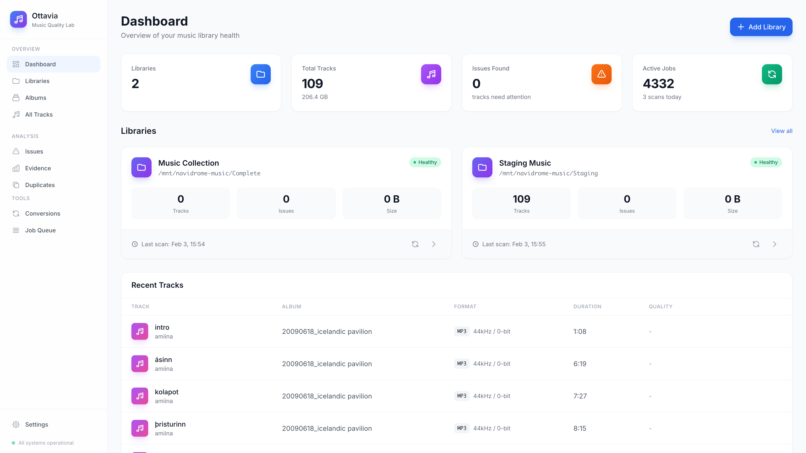
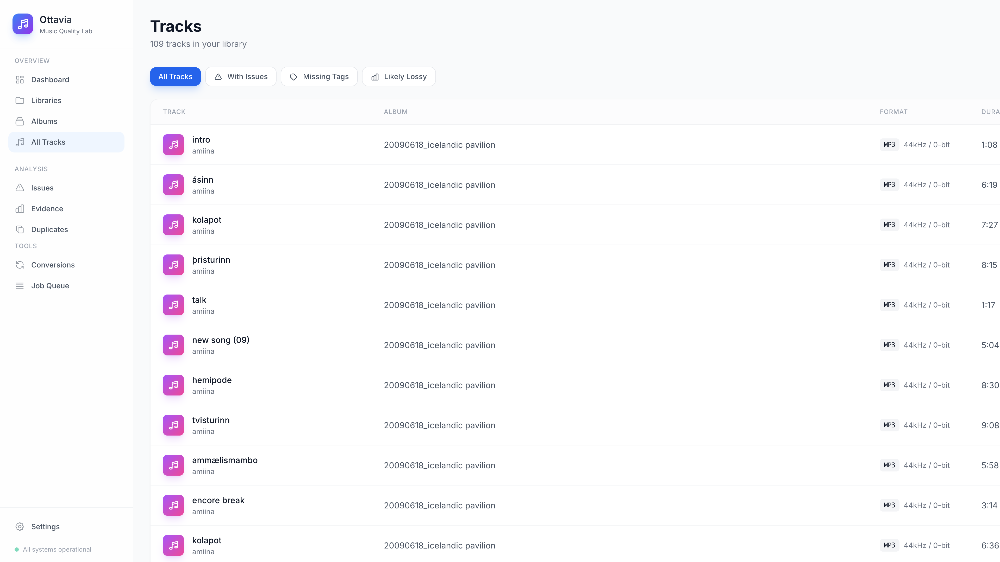
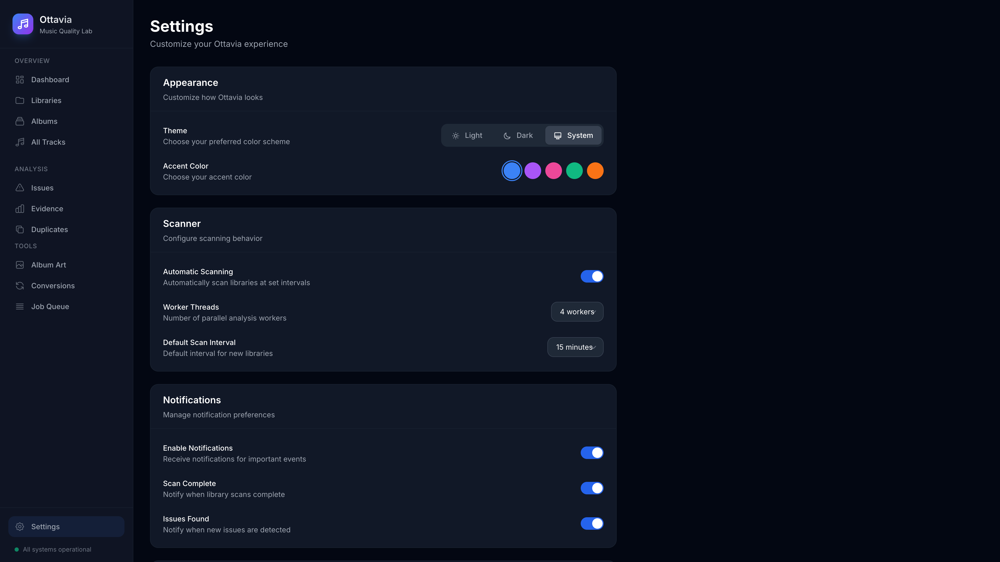

<p align="center">
  
</p>

<h1 align="center">Seville</h1>
<h3 align="center">Music Quality Lab</h3>

<p align="center">
  A self-hosted tool for monitoring music libraries, verifying lossless audio integrity,<br>
  auditing metadata, and managing format conversions.
</p>

<p align="center">
  <a href="#features">Features</a> •
  <a href="#screenshots">Screenshots</a> •
  <a href="#installation">Installation</a> •
  <a href="#usage">Usage</a> •
  <a href="#api">API</a> •
  <a href="#contributing">Contributing</a>
</p>

<p align="center">
  
  
  
  
</p>

<p align="center">
  
  
  
  
</p>

<p align="center">
  
  
  
  
  
  
  
  
</p>

<p align="center">
  
  
  
  
</p>

---

## ✨ Features

### 🔍 **Lossless Verification**
- Detects files that may have been transcoded from lossy sources
- Analyzes high-frequency content and spectral characteristics
- Provides confidence scores with detailed evidence

### 📊 **Audio Analysis**
- Peak level and true peak detection
- Clipping detection with sample counts
- Loudness measurement (LUFS/LRA)
- DC offset and phase correlation analysis
- Waveform and spectrogram visualization

### 🏷️ **Metadata Management**
- Comprehensive tag auditing
- Missing/inconsistent tag detection
- Artwork analysis and management
- Bulk editing with diff preview
- Safe atomic writes with action logging

### 🔄 **Format Conversion**
- Built-in conversion profiles (iPod, Red Book)
- Queue-based job processing
- Provenance tracking
- Re-verification after conversion

### 🖥️ **Modern UI**
- Apple-inspired design language
- Dark/Light theme support
- Responsive layout
- Real-time updates

---

## 📸 Screenshots

<p align="center">
  
  <br>
  <em>Dashboard - Light Mode</em>
</p>

<p align="center">
  
  <br>
  <em>Dashboard - Dark Mode</em>
</p>

<p align="center">
  
  <br>
  <em>Tracks Browser</em>
</p>

<p align="center">
  
  <br>
  <em>Settings - Dark Mode</em>
</p>

<p align="center">
  
  <br>
  <em>Mobile View</em>
</p>

---

## 🚀 Installation

### Prerequisites

- Go 1.22+
- Node.js 18+ (for Tailwind CSS)
- FFmpeg and FFprobe
- SQLite 3.35+

### Quick Start

```bash
# Clone the repository
git clone https://github.com/ParkWardRR/Ottavia-NAS-Music-Quality-Lab.git
cd seville

# Install dependencies and build
make deps
make all

# Run the server
make run
```

Open http://localhost:8080 in your browser.

### Using Go Install

```bash
go install github.com/ParkWardRR/Ottavia-NAS-Music-Quality-Lab/cmd/server@latest
```

### Docker

```bash
docker pull ghcr.io/ParkWardRR/Ottavia-NAS-Music-Quality-Lab:latest
docker run -p 8080:8080 -v /path/to/music:/music -v seville-data:/data ghcr.io/ParkWardRR/Ottavia-NAS-Music-Quality-Lab
```

### From Source

```bash
# Install templ
go install github.com/a-h/templ/cmd/templ@latest

# Install npm dependencies
npm install

# Build everything
make all

# Or step by step
make templ   # Generate templates
make css     # Build Tailwind CSS
make build   # Compile binary
```

---

## ⚙️ Configuration

Create a `config.yaml` file:

```yaml
server:
  host: "0.0.0.0"
  port: 8080

database:
  driver: "sqlite3"
  dsn: "./seville.db"

scanner:
  default_interval: "15m"
  worker_count: 4
  batch_size: 100
  max_retries: 3

storage:
  artifacts_path: "./artifacts/data"
  temp_path: "./artifacts/temp"

ffmpeg:
  ffprobe_path: "ffprobe"
  ffmpeg_path: "ffmpeg"
```

### Environment Variables

| Variable | Description | Default |
|----------|-------------|---------|
| `SEVILLE_CONFIG` | Config file path | `./config.yaml` |
| `SEVILLE_PORT` | Server port | `8080` |
| `SEVILLE_DB_DSN` | Database DSN | `./seville.db` |
| `SEVILLE_DEBUG` | Enable debug mode | `false` |

---

## 📖 Usage

### Adding a Library

1. Click **Add Library** on the dashboard
2. Enter a name and the path to your music folder
3. Set scan interval and read-only mode
4. Click **Add Library**

### Running a Scan

Libraries are scanned automatically at the configured interval. To scan manually:

1. Go to the library card
2. Click the refresh icon
3. Monitor progress in the Jobs view

### Viewing Analysis Results

1. Navigate to **Tracks**
2. Click on any track to view details
3. Review analysis results and evidence
4. Export evidence as JSON/PNG

### Editing Metadata

1. Open track details
2. Click **Edit** in the Metadata section
3. Make changes and preview diff
4. Click **Save** to apply

### Converting Files

1. Select tracks or albums
2. Choose a conversion profile
3. Click **Convert**
4. Monitor progress in Jobs

---

## 🔌 API Reference

### Libraries

| Method | Endpoint | Description |
|--------|----------|-------------|
| `GET` | `/api/libraries` | List all libraries |
| `POST` | `/api/libraries` | Create a library |
| `GET` | `/api/libraries/:id` | Get library details |
| `PUT` | `/api/libraries/:id` | Update a library |
| `DELETE` | `/api/libraries/:id` | Delete a library |
| `POST` | `/api/libraries/:id/scan` | Trigger a scan |

### Tracks

| Method | Endpoint | Description |
|--------|----------|-------------|
| `GET` | `/api/tracks` | List tracks (with filters) |
| `GET` | `/api/tracks/:id` | Get track details |
| `POST` | `/api/tracks/:id/tags` | Update track tags |
| `GET` | `/api/tracks/:id/artifacts` | List evidence artifacts |

### Settings

| Method | Endpoint | Description |
|--------|----------|-------------|
| `GET` | `/api/settings` | Get all settings |
| `POST` | `/api/settings` | Update settings |

### Example Request

```bash
# Create a library
curl -X POST http://localhost:8080/api/libraries \
  -H "Content-Type: application/json" \
  -d '{
    "name": "My Music",
    "rootPath": "/mnt/nas/music",
    "scanInterval": "1h",
    "readOnly": true
  }'

# List tracks with issues
curl "http://localhost:8080/api/tracks?filter=issues&limit=20"
```

---

## 🧪 Testing

### Unit Tests

```bash
make test
```

### E2E Tests (Playwright)

```bash
# Start the server first
make run &

# Run E2E tests
make test-e2e
```

### Generate Screenshots

```bash
make screenshots
```

---

## 🛠️ Development

### Project Structure

```
seville/
├── cmd/
│   └── server/          # Main application entry
├── internal/
│   ├── analyzer/        # Audio analysis engine
│   ├── config/          # Configuration handling
│   ├── database/        # Database layer
│   ├── handlers/        # HTTP handlers
│   ├── models/          # Data models
│   ├── scanner/         # Library scanner
│   └── services/        # Business logic
├── migrations/          # Database migrations
├── tests/
│   └── e2e/            # Playwright tests
└── web/
    ├── static/          # CSS, JS, images
    └── templates/       # Templ templates
```

### Hot Reload Development

```bash
# Install air for hot reload
go install github.com/cosmtrek/air@latest

# Run with hot reload
make dev
```

### Code Style

```bash
# Format code
make fmt

# Run linters
make lint
```

---

## 🗺️ Roadmap

- [x] Phase 0: Project foundation
- [x] Phase 1: Scanner MVP
- [ ] Phase 2: Probe + basic tests
- [ ] Phase 3: Lossy ancestry heuristics
- [ ] Phase 4: Metadata editor
- [ ] Phase 5: Conversion queue
- [ ] Phase 6: Hardening + deployment

See [roadmap.md](roadmap.md) for details.

---

## 🤝 Contributing

Contributions are welcome! Please read our [Contributing Guide](CONTRIBUTING.md) for details.

1. Fork the repository
2. Create a feature branch (`git checkout -b feature/amazing`)
3. Commit your changes (`git commit -m 'Add amazing feature'`)
4. Push to the branch (`git push origin feature/amazing`)
5. Open a Pull Request

---

## 📄 License

This project is licensed under the [Blue Oak Model License 1.0.0](LICENSE).

---

## 🙏 Acknowledgments

- [FFmpeg](https://ffmpeg.org/) - Audio analysis and conversion
- [templ](https://templ.guide/) - Go HTML templating
- [Tailwind CSS](https://tailwindcss.com/) - Styling
- [Alpine.js](https://alpinejs.dev/) - Interactivity
- [Playwright](https://playwright.dev/) - E2E testing

---

<p align="center">
  <strong>Made with ❤️ for audiophiles everywhere</strong>
</p>

<p align="center">
  <a href="https://github.com/ParkWardRR/Ottavia-NAS-Music-Quality-Lab">
    
  </a>
</p>
